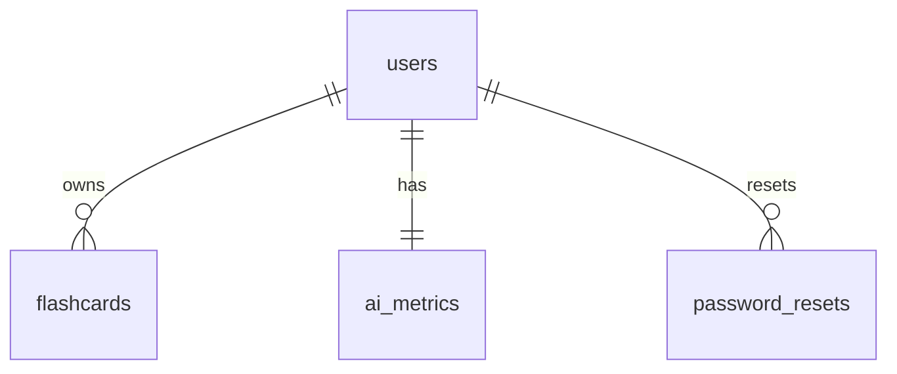

## 1. Tables

### 1.1 `users`
This table is managed by Supabase auth

| column        | type        | constraints                                |
| ------------- | ----------- | ------------------------------------------ |
| id            | uuid        | PK (default `gen_random_uuid()`), not null |
| email         | text        | unique, not null                           |
| created_at    | timestamptz | default `now()`, not null                  |
| last_login_at | timestamptz |                                            |

CHECKS  
`email ~* '^[^@]+@[^@]+\.[^@]+$'`

---

### 1.2 `flashcards`
| column         | type        | constraints / default                                                                  |
| -------------- | ----------- | -------------------------------------------------------------------------------------- |
| id             | uuid        | PK (`gen_random_uuid()`), not null                                                     |
| user_id        | uuid        | FK → `users(id)` ON DELETE CASCADE, not null                                           |
| question       | text        | not null, CHECK word‑count 4–50                                                        |
| answer         | text        | not null, CHECK word‑count 4–200                                                       |
| difficulty     | integer     | default 0, CHECK max difficulty 5, min difficulty 1. 0 means card was not reviewed yet |
| ai_generated   | boolean     | default false, not null                                                                |
| ai_status      | smallint    | NULL / 0=accepted (no edit),1=edited,2=rejected, CHECK 0–2                             |
| next_review_at | timestamptz | default `now()`, not null                                                              |
| created_at     | timestamptz | default `now()`, not null                                                              |
| updated_at     | timestamptz | default `now()`, not null                                                              |

---

### 1.3 `ai_metrics`
| column            | type        | constraints                           |
|-------------------|-------------|---------------------------------------|
| user_id           | uuid        | PK & FK → `users(id)` ON DELETE CASCADE|
| accepted_cnt      | integer     | default 0, not null                  |
| generated_cnt     | integer     | default 0, not null                  |
| updated_at        | timestamptz | default `now()`, not null            |

---

### 1.4 `password_resets`
| column       | type        | constraints                                  |
|--------------|-------------|----------------------------------------------|
| id           | uuid        | PK (`gen_random_uuid()`), not null           |
| user_id      | uuid        | FK → `users(id)` ON DELETE CASCADE, not null |
| token        | text        | unique, not null                             |
| expires_at   | timestamptz | not null                                     |
| created_at   | timestamptz | default `now()`, not null                    |

---

## 2. Relations (Mermaid)



---

## 3. Indexes

```sql
-- fast auth & joins
create index flashcards_user_idx          on flashcards(user_id);
-- spaced‑repetition scheduling
create index flashcards_next_review_idx   on flashcards(next_review_at);
-- AI stats
create index flashcards_ai_generated_idx  on flashcards(ai_generated);
create unique index password_resets_token_idx on password_resets(token);
```

---

## 4. Row‑Level Security (RLS)

```sql
-- USERS
alter table users enable row level security;
create policy "own_profile" on users
  for all using (auth.uid() = id);

-- FLAShCARDS
alter table flashcards enable row level security;
create policy "own_cards" on flashcards
  for all using (auth.uid() = user_id)
  with check (auth.uid() = user_id);

-- AI_METRICS
alter table ai_metrics enable row level security;
create policy "own_metrics" on ai_metrics
  for select, update using (auth.uid() = user_id);

-- PASSWORD_RESETS
alter table password_resets enable row level security;
create policy "reset_token" on password_resets
  for select, delete using (auth.uid() = user_id)
  with check (auth.uid() = user_id);
```

---

## 5. Notes

• UUID PKs aid sharding & avoid hot‑spotting.  
• Word‑count checks:  
```sql
check (array_length(regexp_split_to_array(question, '\s+'),1) between 4 and 50)
```  
(similar for `answer`).  
• `ai_metrics` can be kept in sync via triggers on `flashcards`.  
• Supabase handles password hashing; `password_resets` only stores one‑time tokens.  
• Schema normalized to 3NF; no denormalization needed for MVP.